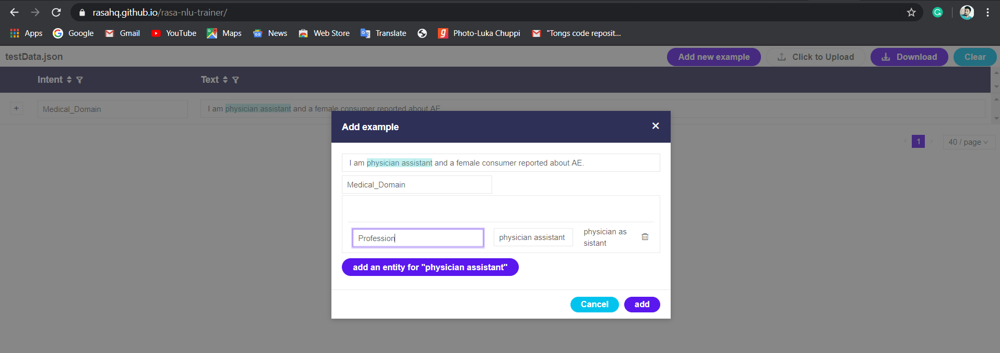

# Custom-NER-Spacy-Pipeline
Adding new pipeline for custom NER operations using .JSON as training data.

## Introduction
When it comes to identify entities from free text in python spacy we use default entity recognition approach.
But when we have domain specific entities which we want to extract from free text at that very time old approach will not give you 100% results.

At that time we use Custom NER by adding pipeline and using .json as training data file

In this simple project we are going to extract "profession" in free text.

## https://rasahq.github.io/rasa-nlu-trainer/ - Use this to create training .json file

Once you visit above site do below steps.
1. Clear existing sentences.
2. Add new training sentence.
3. Add Intent for that sentence.
4. Select the mast of sentence which we want to extract refer above image.
5. Add the label for that selected text.
6. After adding couple of sentences click on download button.
7. Download and save that file in same folder as your .py

